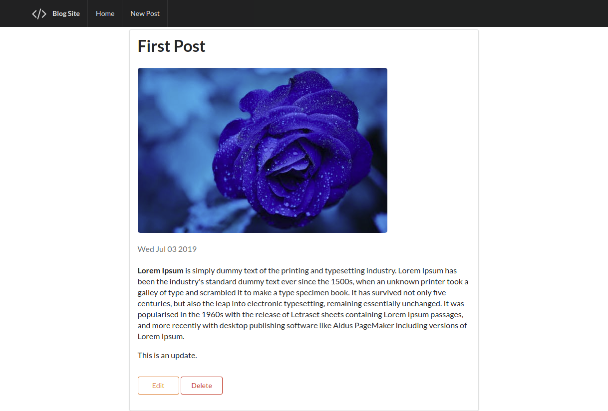

# RESTful-Blog
Blog app implementing RESTful routes

### RESTFUL Chart


### Functions

1. Index Page
   
   

2. Create Blog Post
   
   

3. Edit Blog Post
   
   

4. Show Full Blog Post (Including Edit and Delete)
   
   


### Dependencies
* node
* npm
* mongodb

### Usage

```
npm install
node app.js

// In browser
localhost:3000
```

